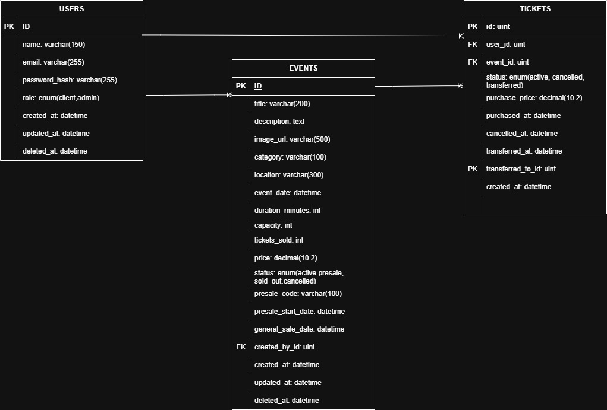

# Ceibo Tickets - Sistema de Gestion de Eventos y Entradas

Sistema de venta de entradas para eventos con roles de cliente y administrador, desarrollado como practico integrador 2026.

## Tecnologias utilizadas

| Capa | Tecnologia |
|------|-----------|
| **Backend** | Go 1.26, Gin, GORM, MySQL |
| **Frontend** | React 19, TypeScript 6, Vite 8 |
| **Autenticacion** | JWT (golang-jwt), bcrypt |
| **Testing** | Go testing + testify |

## Requisitos previos

- Go 1.26+
- Node.js 26+
- MySQL 8+

## Instalacion y uso

```bash
# Clonar
git clone <repo-url>
cd soft-dev-project

# Backend
cd backend
cp .env.example .env    # configurar credenciales
go mod tidy
go run main.go

# Frontend
cd frontend
npm install
npm run dev
```

### Variables de entorno (backend)

Ver .env.example para configuracion de base de datos, JWT, TLS y email.

## Diagrama de base de datos



El esquema completo se encuentra en [docs/schema.sql](docs/schema.sql).

### Entidades principales

- **users** - clientes y administradores (soft-delete con GORM)
- **events** - eventos con soporte de preventa (fechas, codigo, fases de venta)
- **tickets** - entradas con estados: activa, cancelada, transferida

## Decisiones de diseno

### 1. DAOs como interfaces para testabilidad

Los repositorios (UserDAO, EventDAO, TicketDAO) se definen como interfaces en dao/interfaces.go. Esto permite inyectar mocks en los servicios y testear la logica de negocio sin base de datos real, siguiendo el principio de inversion de dependencias.

### 2. Fases de venta con logica de dominio pura

La preventa se modela con fechas (presale_start_date, general_sale_date) y un metodo CurrentSalePhase() en la entidad Event. Esto centraliza la logica en el dominio y la hace testeable sin depender del servicio o la base de datos.

### 3. Email client con strategy pattern

El cliente de email (clients/email_client.go) tiene dos implementaciones: logEmailClient para desarrollo (solo loguea) y smtpEmailClient para produccion. La seleccion se hace por variable de entorno, y la interfaz permite mockear en tests.

## Testing

```bash
cd backend
go test ./... -v -cover
```

### Cobertura por paquete

| Paquete | Tipo | Cobertura actual |
|---------|------|:----------------:|
| domain/ | Unitario (puro) | 9/9 tests |
| utils/ | Unitario (puro) | 9/9 tests |
| services/ | Unitario (mocks) | 27/27 tests |
| controllers/ | Integracion (httptest) | 27/27 tests |

### Tests de servicios

Usan **testify/mock** para simular los DAOs. Cada servicio se testea de forma aislada.

### Tests de controladores

Usan **net/http/httptest** para enviar requests HTTP directamente contra los handlers.

### Tests ejecutados

- TestCurrentSalePhase - 9 subtest (todos PASS) que cubren las 4 fases de venta mas casos borde con fechas nil y valores exactos en los limites.

### Tests de utils

- **password_test.go** - HashPassword, CheckPassword (correcta, incorrecta, vacia), HashPasswordUnique
- **jwt_test.go** - GenerateJWT, ValidateToken (valido, firma invalida, malformado, vacio)

### Tests de servicios (con testify/mock)

- **auth_service_test.go** - Register (exito, password corta, email duplicado), Login (exito, password incorrecta, email desconocido)
- **event_service_test.go** - GetAll, GetByID (exito, no encontrado), Create (valido, titulo vacio, capacidad cero, fecha pasada), Cancel (activo, ya cancelado, no encontrado), Update (exito, cancelado, no encontrado)
- **ticket_service_test.go** - Purchase (exito, evento cancelado, sin capacidad), PurchasePresale (codigo correcto, sin codigo, codigo incorrecto), CancelTicket (propio, ajeno, ya cancelado), Transfer (a otro usuario, a si mismo), GetByUser, PurchaseNotFound
- **report_service_test.go** - GetEventReport (exito, no encontrado), GetGlobalReport

### Tests de controladores (httptest)

- **middleware_test.go** - AuthRequired (sin header, formato invalido, token malformado), AdminRequired (admin pasa, client 403, sin rol 403)
- **auth_controller_test.go** - Register (201, 400 campos faltantes, 400 email duplicado), Login (200 con token, 401 credenciales invalidas, 400 campo faltante)
- **event_controller_test.go** - GetAll (200), GetByID (200, 404, 400), Create (201, 400), Update (200, 404), Delete (204, 404), GetSaleStatus (200)
- **ticket_controller_test.go** - Purchase (201, 400 evento cancelado, 400 campo faltante), GetMyTickets (200), Cancel (204, 404), Transfer (200, 400 campo faltante)
- **admin_controller_test.go** - GetReports (200), GetEventReport (200, 404)

## Funcionalidades

### Cliente
- Exploracion y filtro de eventos
- Detalle de evento
- Compra de entradas
- Historial "Mis Entradas"
- Cancelacion de compra
- Traspaso de entrada

### Administrador
- Creacion, actualizacion y cancelacion de eventos
- Reportes y metricas (ocupacion, ventas, compradores)

### Extra (Bonus Track)
- Preventa con codigo de acceso y fechas diferenciadas
- Fases de venta: no abierta - preventa - venta general
