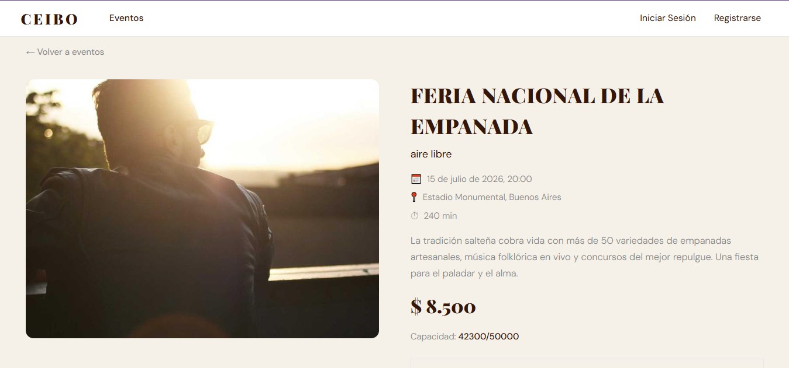
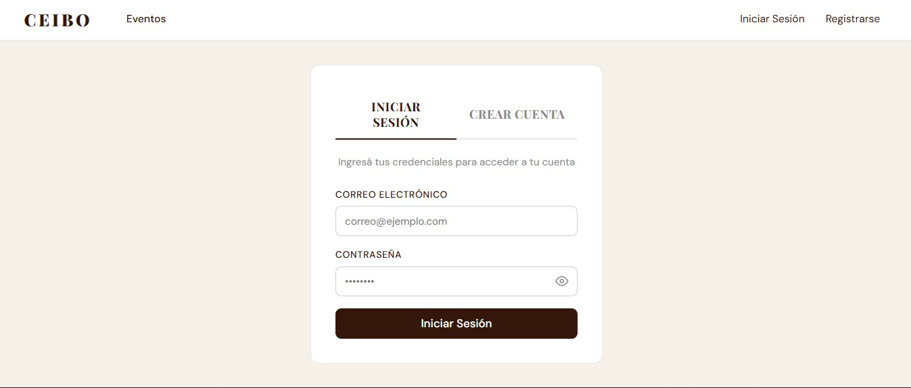
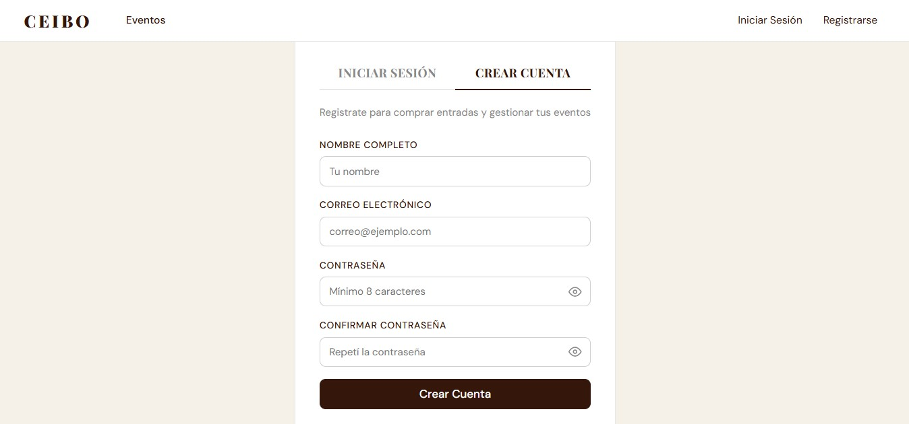
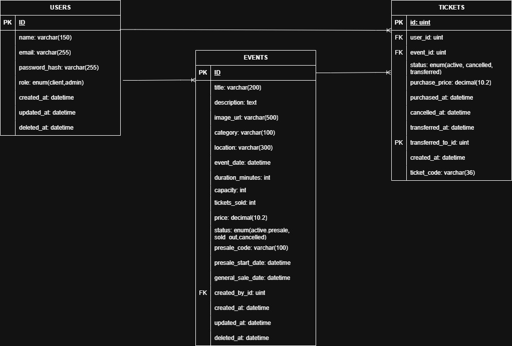

# Ceibo Tickets - Sistema de Gestion de Eventos y Entradas

Sistema de venta de entradas para eventos con roles de **cliente** y **administrador**, desarrollado como practico integrador 2026 de la Universidad Catolica de Cordoba. El backend expone una API REST en Go con arquitectura MVC, el frontend es una SPA en React + TypeScript, y los datos se persisten en MySQL con GORM.

El flujo del sistema es el siguiente:
El usuario ingresa al sitio, explora el catalogo de eventos con filtros por categoria y fecha, y selecciona un evento para ver su detalle (descripcion, fecha, ubicacion, capacidad, precio). Si desea comprar, debe registrarse o iniciar sesion; luego puede adquirir una o mas entradas, ingresando un codigo de preventa si corresponde. La compra se procesa con validaciones de capacidad y fase de venta, y se confirma via email. El usuario puede ver sus entradas en "Mis Entradas", cancelarlas o transferirlas a otro usuario por email. Del lado del administrador, este puede crear, editar y cancelar eventos, configurar preventas con codigo de acceso y fechas diferenciadas, y consultar reportes globales o por evento con detalle de compradores.

---

## Tecnologias utilizadas

| Capa              | Tecnologia                      |
| ----------------- | ------------------------------- |
| **Backend**       | Go 1.26, Gin, GORM              |
| **Base de datos** | MySQL 8                         |
| **Frontend**      | React 19, TypeScript, Vite      |
| **Autenticacion** | JWT, bcrypt                     |
| **Testing**       | Go testing + testify + httptest |

---

## Requisitos previos

- Go 1.26+, Node.js 26+, MySQL 8+

---

## Instalacion y uso

```bash
# Clonar
git clone <repo-url>
cd soft-dev-project

# Backend
cd backend
cp .env.example .env   # configurar credenciales
go mod tidy
go run main.go

# Frontend
cd frontend
npm install
npm run dev

# Tests
cd backend
go test ./... -v -cover
```

Las variables de entorno se configuran en `backend/.env` (ver `.env.example`). El servidor inicia en `https://localhost:8443` (TLS obligatorio) y el frontend en `http://localhost:5173`.

---

## Capturas de pantalla

| Vista               | Imagen                                        |
| ------------------- | --------------------------------------------- |
| Pagina principal    |             |
| Catalogo de eventos |   |
| Detalle de evento   |  |
| Inicio de sesion    |           |
| Registro de usuario |     |

---

## Diagrama de base de datos



El modelo consta de tres tablas principales (`users`, `events`, `tickets`) con relaciones de clave foranea, soft-delete, indices compuestos y transacciones atomicas para operaciones criticas. El esquema completo esta en `database/schema.sql` con datos de ejemplo en `database/data.sql` (13 usuarios, 23 eventos, 35 tickets).

---

## Decisiones de diseno

**1. DAOs como interfaces para testabilidad.** Los repositorios (UserDAO, EventDAO, TicketDAO) se definen como interfaces en `dao/interfaces.go`. Esto permite inyectar mocks en los servicios y testear la logica de negocio sin base de datos real, siguiendo el principio de inversion de dependencias.

```go
type UserDAO interface {
    Create(user *domain.User) error
    FindByEmail(email string) (*domain.User, error)
    FindByID(id uint) (*domain.User, error)
}
```

**2. Fases de venta con logica de dominio pura.** La preventa se modela con fechas en la entidad `Event` y un metodo `CurrentSalePhase()` que determina la fase actual (no abierta, preventa, venta general, sin preventa). Esto centraliza la logica en el dominio y la hace testeable sin depender del servicio ni de la base de datos.

**3. Email client con strategy pattern.** El cliente de email tiene dos implementaciones intercambiables via variable de entorno (`EMAIL_PROVIDER=log` en desarrollo, `EMAIL_PROVIDER=smtp` en produccion). La interfaz permite mockear en tests y cambiar la implementacion sin modificar el codigo de negocio.

**4. Transacciones atomicas.** Las operaciones criticas (compra, cancelacion, transferencia) se ejecutan dentro de transacciones SQL via `WithTransaction()`, garantizando consistencia entre la creacion/modificacion del ticket y el ajuste del contador `tickets_sold` del evento. Si algo falla, se revierte todo (rollback).

---

## Testing

```bash
cd backend
go test ./... -v -cover
```

### Cobertura por paquete

| Paquete        | Tipo                              | Tests |
| -------------- | --------------------------------- | :---: |
| `domain/`      | Unitario (puro, sin dependencias) |  9/9  |
| `utils/`       | Unitario (puro)                   |  9/9  |
| `services/`    | Unitario (con testify/mock)       | 27/27 |
| `controllers/` | Integracion (httptest)            | 27/27 |

### Tests de dominio

Prueban logica pura sin dependencias externas.

| Archivo         | Casos cubiertos                                                                                                                 |
| --------------- | ------------------------------------------------------------------------------------------------------------------------------- |
| `event_test.go` | `CurrentSalePhase` - 9 subtests que cubren las 4 fases de venta mas casos borde con fechas nil y valores exactos en los limites |

### Tests de utils

Prueban funciones de utilidad aisladas.

| Archivo            | Casos cubiertos                                                               |
| ------------------ | ----------------------------------------------------------------------------- |
| `password_test.go` | HashPassword, CheckPassword (correcta, incorrecta, vacia), HashPasswordUnique |
| `jwt_test.go`      | GenerateJWT, ValidateToken (valido, firma invalida, malformado, vacio)        |

### Tests de servicios

Usan **testify/mock** para simular los DAOs y el cliente de email. Cada servicio se testea de forma aislada sin base de datos.

| Archivo                  | Casos cubiertos                                                                                                                                                                                                                     |
| ------------------------ | ----------------------------------------------------------------------------------------------------------------------------------------------------------------------------------------------------------------------------------- |
| `auth_service_test.go`   | Register (exito, password corta, email duplicado), Login (exito, password incorrecta, email desconocido)                                                                                                                            |
| `event_service_test.go`  | GetAll, GetByID (exito, no encontrado), Create (valido, titulo vacio, capacidad cero, fecha pasada), Cancel (activo, ya cancelado, no encontrado), Update (exito, cancelado, no encontrado)                                         |
| `ticket_service_test.go` | Purchase (exito, evento cancelado, sin capacidad), PurchasePresale (codigo correcto, sin codigo, codigo incorrecto), CancelTicket (propio, ajeno, ya cancelado), Transfer (a otro usuario, a si mismo), GetByUser, PurchaseNotFound |
| `report_service_test.go` | GetEventReport (exito, no encontrado), GetGlobalReport                                                                                                                                                                              |

### Tests de controladores

Usan **net/http/httptest** para enviar requests HTTP directamente contra los handlers con servicios mockeados.

| Archivo                     | Casos cubiertos                                                                                                                     |
| --------------------------- | ----------------------------------------------------------------------------------------------------------------------------------- |
| `middleware_test.go`        | AuthRequired (sin header, formato invalido, token malformado), AdminRequired (admin pasa, client 403, sin rol 403)                  |
| `auth_controller_test.go`   | Register (201, 400 campos faltantes, 400 email duplicado), Login (200 con token, 401 credenciales invalidas, 400 campo faltante)    |
| `event_controller_test.go`  | GetAll (200), GetByID (200, 404, 400), Create (201, 400), Update (200, 404), Delete (204, 404), GetSaleStatus (200)                 |
| `ticket_controller_test.go` | Purchase (201, 400 evento cancelado, 400 campo faltante), GetMyTickets (200), Cancel (204, 404), Transfer (200, 400 campo faltante) |
| `admin_controller_test.go`  | GetReports (200), GetEventReport (200, 404)                                                                                         |

---

## Autores

BRUA, Jonathan — HERNANDEZ, Juan — LINDON, Maria Victoria — TERRERA, Athina

Proyecto integrador 2026 - Universidad Catolica de Cordoba (UCC)
