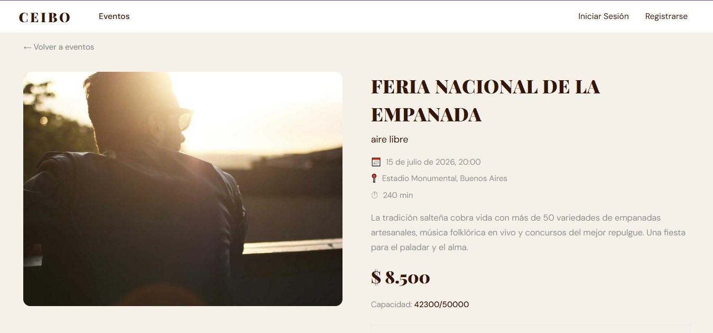
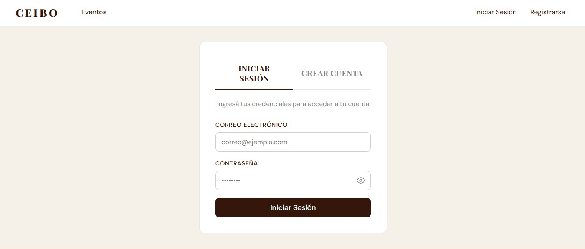
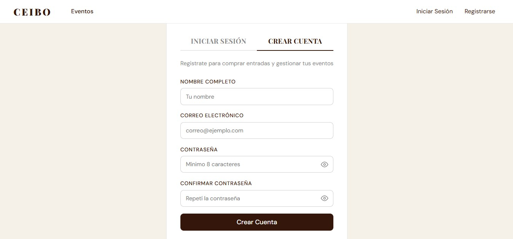
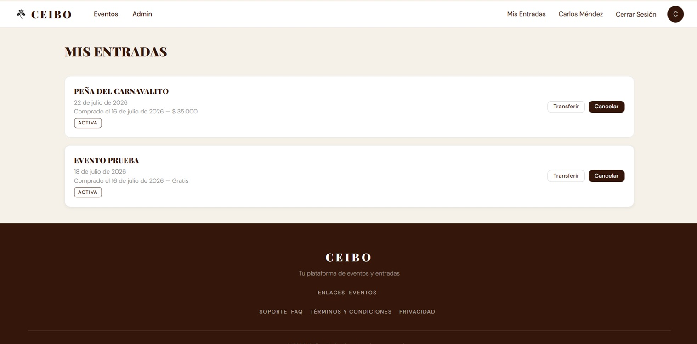
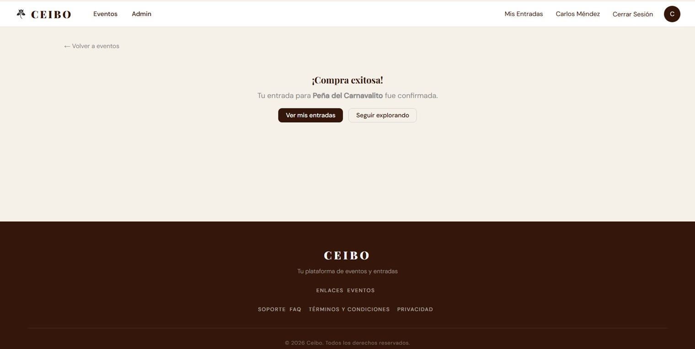
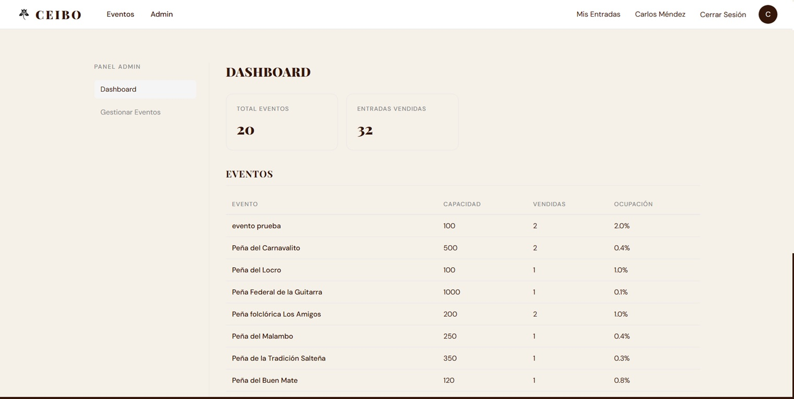
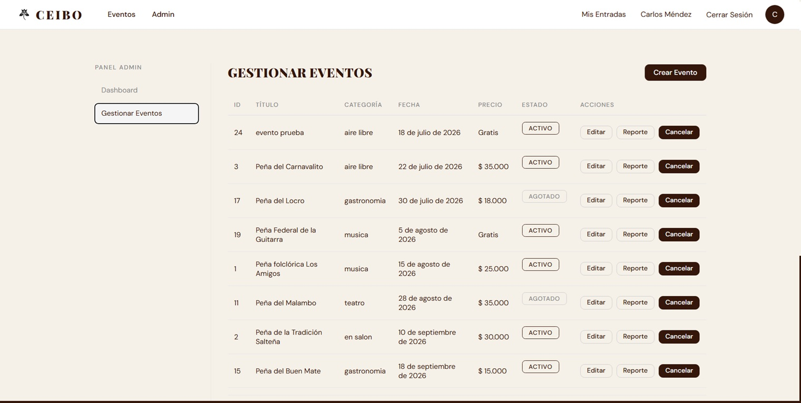
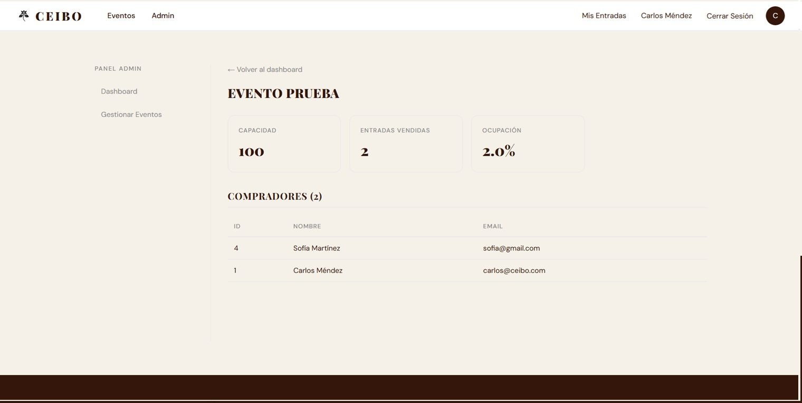
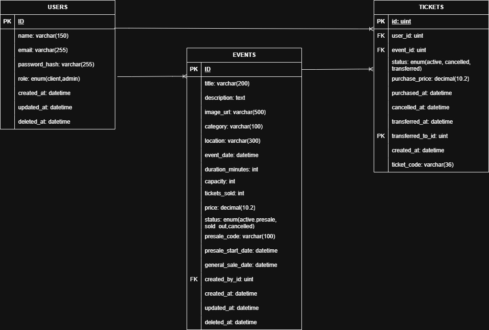

# Ceibo Tickets - Sistema de Gestion de Eventos y Entradas

Sistema de venta de entradas para eventos con roles de **cliente** y **administrador**, desarrollado como practico integrador 2026 de la Universidad Catolica de Cordoba. El backend expone una API REST en Go con arquitectura MVC, el frontend es una SPA en React + TypeScript, y los datos se persisten en MySQL con GORM.

El flujo del sistema es el siguiente:
El usuario ingresa al sitio, explora el catalogo de eventos con filtros por categoria y fecha, y selecciona un evento para ver su detalle (descripcion, fecha, ubicacion, capacidad, precio). Si desea comprar, debe registrarse o iniciar sesion; luego puede adquirir una o mas entradas, ingresando un codigo de preventa si corresponde. La compra se procesa con validaciones de capacidad y fase de venta, y se confirma via email. El usuario puede ver sus entradas en "Mis Entradas", cancelarlas o transferirlas a otro usuario por email. Del lado del administrador, este puede crear, editar y cancelar eventos, configurar preventas con codigo de acceso y fechas diferenciadas, y consultar reportes globales o por evento con detalle de compradores.

---

## Tabla de contenidos

1. [Tecnologias utilizadas](#tecnologias-utilizadas)
2. [Requisitos previos](#requisitos-previos)
3. [Instalacion y uso](#instalacion-y-uso)
4. [Estructura del proyecto](#estructura-del-proyecto)
5. [Capturas de pantalla](#capturas-de-pantalla)
6. [Diagrama de base de datos](#diagrama-de-base-de-datos)
7. [Endpoints de la API](#endpoints-de-la-api)
8. [Decisiones de diseno](#decisiones-de-diseno)
9. [Testing](#testing)
10. [Bonus Track](#bonus-track)
11. [Autores](#autores)

---

## Tecnologias utilizadas

| Capa              | Tecnologia                                    |
| ----------------- | --------------------------------------------- |
| **Backend**       | Go 1.26, Gin, GORM                            |
| **Base de datos** | MySQL 8                                       |
| **Frontend**      | React 19, TypeScript, Vite                    |
| **Autenticacion** | JWT (golang-jwt), bcrypt                      |
| **Testing**       | Go testing + testify + httptest               |
| **DevOps**        | Docker, Docker Compose, Nginx                 |
| **Seguridad**     | TLS, headers de seguridad, CORS configurable  |

---

## Requisitos previos

- Go 1.26+
- Node.js 26+
- MySQL 8+ (solo si corre local sin Docker)
- Docker + Docker Compose (para levantar con contenedores)

---

## Instalacion y uso

### Opcion 1: Con Docker (recomendado)

Levantá todo el stack (base de datos, backend y frontend) con un solo comando:

```bash
git clone <repo-url>
cd soft-dev-project
docker-compose up --build
```

Los servicios quedan disponibles en:

| Servicio  | URL                          |
| --------- | ---------------------------- |
| Frontend  | http://localhost              |
| Backend   | https://localhost:8443        |
| MySQL     | localhost:3307                |

Para detener y limpiar:

```bash
docker-compose down           # detiene los contenedores
docker-compose down -v        # detiene y elimina los volúmenes (borra la base)
```

Los datos seed (13 usuarios, 23 eventos, 35 tickets) se cargan automaticamente al iniciar la base por primera vez. Algunos usuarios de prueba:

| Email                       | Password    | Rol      |
| --------------------------- | ----------- | -------- |
| carlos@example.com          | carlos123   | admin    |
| ana@example.com             | ana123      | admin    |
| sofia@example.com           | sofia123    | cliente  |
| lautaro@example.com         | lautaro123  | cliente  |

### Opcion 2: Local (sin Docker)

```bash
# Clonar
git clone <repo-url>
cd soft-dev-project

# Backend
cd backend
cp .env.example .env   # configurar credenciales de MySQL
go mod tidy
go run main.go

# En otra terminal - Frontend
cd frontend
npm install
npm run dev
```

Las variables de entorno se configuran en `backend/.env` (ver `.env.example`). El servidor inicia en `https://localhost:8443` (TLS obligatorio) y el frontend en `http://localhost:5173`.

---

## Estructura del proyecto

```
soft-dev-project/
├── backend/
│   ├── main.go                 # Punto de entrada, configura servidor HTTP y rutas
│   ├── Dockerfile              # Build multi-etapa (golang -> alpine)
│   ├── .env.example            # Variables de entorno de ejemplo
│   ├── cmd/
│   │   └── gencerts/main.go    # Generador de certificados auto-firmados
│   ├── domain/                 # Entidades del negocio (User, Event, Ticket)
│   ├── dao/                    # Acceso a datos via GORM (interfaces + implementaciones)
│   ├── services/               # Logica de negocio
│   ├── controllers/            # Handlers HTTP + middleware (auth, admin, CORS, seguridad)
│   ├── clients/                # Clientes externos (email via SMTP o log)
│   ├── utils/                  # Utilidades (JWT, password hashing)
│   ├── logger/                 # Logger estructurado JSON
│   └── certs/                  # Certificados TLS
├── frontend/
│   ├── Dockerfile              # Build multi-etapa (node -> nginx)
│   ├── nginx.conf              # SPA fallback + reverse proxy a backend
│   ├── src/
│   │   ├── api/                # Capa de cliente HTTP (axios)
│   │   ├── types/              # Definiciones TypeScript
│   │   ├── context/            # AuthContext (estado de sesion)
│   │   ├── hooks/              # Custom hooks (useEvents, useTickets)
│   │   ├── pages/              # Vistas: Home, Events, Detail, Auth, Tickets, Admin
│   │   ├── components/         # Componentes reutilizables (cards, modals, layout)
│   │   └── data/               # Datos mock como fallback
│   └── public/                 # Assets estaticos
├── database/
│   ├── schema.sql              # DDL: CREATE TABLE con FK, indices, constraints
│   └── data.sql                # Datos seed (13 usuarios, 23 eventos, 35 tickets)
├── docs/
│   ├── Diagrama.jpg            # Diagrama ER
│   └── screenshots/            # Capturas de pantalla del sistema
├── docker-compose.yml          # Orquestacion de 3 servicios
└── README.md
```

---

## Capturas de pantalla

| Vista                      | Imagen                                               |
| -------------------------- | ---------------------------------------------------- |
| Pagina principal           |                    |
| Catalogo de eventos        |          |
| Detalle de evento          |         |
| Inicio de sesion           |                  |
| Registro de usuario        |            |
| Mis Entradas               |      |
| Flujo de compra            |              |
| Panel administrador        |            |
| Gestion de eventos (Admin) |   |
| Reporte de evento (Admin)  |         |

---

## Diagrama de base de datos



El modelo consta de tres tablas principales:

- **users**: almacenamiento de usuarios con roles (cliente/admin), password hasheada con bcrypt, y soft-delete.
- **events**: eventos con soporte para preventa (codigo + fechas), estados (active, presale, sold_out, cancelled), y capacidad maxima.
- **tickets**: entradas vendidas con estados (active, cancelled, transferred), precio de compra, y referencia al usuario comprador y al evento.

Las relaciones implementadas son: tickets -> users (comprador), tickets -> events (evento), tickets -> users (transferido a), events -> users (creado por). El esquema completo esta en `database/schema.sql` con datos de ejemplo en `database/data.sql` (13 usuarios, 23 eventos, 35 tickets).

---

## Endpoints de la API

### Autenticacion (publicos)

| Metodo | Endpoint                | Descripcion            |
| ------ | ----------------------- | ---------------------- |
| POST   | `/api/auth/register`    | Registro de usuario    |
| POST   | `/api/auth/login`       | Login y obtencion JWT  |

### Cliente (requieren JWT)

| Metodo | Endpoint                        | Descripcion                           |
| ------ | ------------------------------- | ------------------------------------- |
| GET    | `/api/events`                   | Listado de eventos (filtros opcionales) |
| GET    | `/api/events/:id`               | Detalle de un evento                  |
| GET    | `/api/events/:id/sale-status`   | Estado de venta de un evento          |
| POST   | `/api/tickets/purchase`         | Compra de entrada                     |
| GET    | `/api/tickets`                  | Mis entradas                          |
| PATCH  | `/api/tickets/:id/cancel`       | Cancelar entrada                      |
| PATCH  | `/api/tickets/:id/transfer`     | Transferir entrada a otro usuario     |

### Administrador (requieren JWT + rol admin)

| Metodo | Endpoint                          | Descripcion                    |
| ------ | --------------------------------- | ------------------------------ |
| POST   | `/api/admin/events`               | Crear evento                   |
| PUT    | `/api/admin/events/:id`           | Actualizar evento              |
| DELETE | `/api/admin/events/:id`           | Cancelar evento                |
| GET    | `/api/admin/reports`              | Reporte global de ocupacion    |
| GET    | `/api/admin/reports/events/:id`   | Reporte de un evento specifico |

### Seguridad

- **JWT**: tokens con 24h de expiracion, firmados con HS256. El payload contiene `user_id` y `role`.
- **Passwords**: hasheadas con bcrypt (cost 12), nunca se almacenan en texto plano.
- **Middleware**: `AuthRequired` valida el token Bearer, `AdminRequired` verifica el rol.
- **Headers**: HSTS, X-Content-Type-Options, X-Frame-Options, CSP, Referrer-Policy.
- **CORS**: configurable via variable de entorno `CORS_ALLOWED_ORIGINS`.

---

## Decisiones de diseno

**1. DAOs como interfaces para testabilidad.** Los repositorios (UserDAO, EventDAO, TicketDAO) se definen como interfaces en `dao/interfaces.go`. Esto permite inyectar mocks en los servicios y testear la logica de negocio sin base de datos real, siguiendo el principio de inversion de dependencias.

```go
type UserDAO interface {
    Create(user *User) error
    FindByEmail(email string) (*User, error)
    FindByID(id uint) (*User, error)
}
```

**2. Fases de venta con logica de dominio pura.** La preventa se modela con fechas en la entidad `Event` y un metodo `CurrentSalePhase()` que determina la fase actual (no abierta, preventa, venta general, sin preventa). Esto centraliza la logica en el dominio y la hace testeable sin depender del servicio ni de la base de datos.

**3. Email client con strategy pattern.** El cliente de email tiene dos implementaciones intercambiables via variable de entorno (`EMAIL_PROVIDER=log` en desarrollo, `EMAIL_PROVIDER=smtp` en produccion). La interfaz permite mockear en tests y cambiar la implementacion sin modificar el codigo de negocio.

**4. Transacciones atomicas.** Las operaciones criticas (compra, cancelacion, transferencia) se ejecutan dentro de transacciones SQL via `WithTransaction()`, garantizando consistencia entre la creacion/modificacion del ticket y el ajuste del contador `tickets_sold` del evento. Si algo falla, se revierte todo (rollback).

---

## Testing

```bash
# Todos los tests
cd backend
go test ./... -v -cover

# Tests de un paquete especifico
go test ./services/... -v -cover
go test ./controllers/... -v -cover

# Generar reporte de cobertura HTML
go test ./... -coverprofile=coverage.out
go tool cover -html=coverage.out -o coverage.html
```

Con Docker:

```bash
docker-compose exec backend go test ./... -v -cover
```

### Cobertura por paquete

| Paquete        | Tipo                              | Cobertura |
| -------------- | --------------------------------- | :-------: |
| `domain/`      | Unitario (puro, sin dependencias) |  100.0%   |
| `utils/`       | Unitario (puro)                   |   90.9%   |
| `clients/`     | Unitario (con testify/mock)       |   93.5%   |
| `logger/`      | Unitario (con testify)            |  100.0%   |
| `services/`    | Unitario (con testify/mock)       |   99.3%   |
| `controllers/` | Integracion (httptest)            |   95.2%   |

### Estrategia de testing

- **Dominio**: pruebas puras de logica sin dependencias externas. `CurrentSalePhase()` se testea con 9 subtests cubriendo las 4 fases de venta mas casos borde.
- **Servicios**: usan **testify/mock** para simular los DAOs y el cliente de email. Cada servicio se testea de forma aislada sin base de datos.
- **Controladores**: usan **net/http/httptest** para enviar requests HTTP directamente contra los handlers con servicios mockeados.
- **Mocks**: definidos en `services/mocks_test.go` y `controllers/mocks_test.go`. Interfaces de DAO como costuras (seams) para inyeccion de dependencias.

### Tests de dominio

| Archivo         | Casos cubiertos                                                                                                                 |
| --------------- | ------------------------------------------------------------------------------------------------------------------------------- |
| `event_test.go` | `CurrentSalePhase` - 9 subtests que cubren las 4 fases de venta mas casos borde con fechas nil y valores exactos en los limites |

### Tests de utils

| Archivo            | Casos cubiertos                                                               |
| ------------------ | ----------------------------------------------------------------------------- |
| `password_test.go` | HashPassword, CheckPassword (correcta, incorrecta, vacia), HashPasswordUnique |
| `jwt_test.go`      | GenerateJWT, ValidateToken (valido, firma invalida, malformado, vacio)        |

### Tests de servicios

| Archivo                  | Casos cubiertos                                                                                                                                                                                                                                                                      |
| ------------------------ | ------------------------------------------------------------------------------------------------------------------------------------------------------------------------------------------------------------------------------------------------------------------------------------ |
| `auth_service_test.go`   | Register (exito, password corta, email duplicado, error de conexion en busqueda, error de creacion), Login (exito, password incorrecta, email desconocido), GenerateToken, NotFound error                                                                                            |
| `event_service_test.go`  | GetAll, GetByID (exito, no encontrado), Create (valido, titulo vacio, capacidad cero, fecha pasada, presale activo, presale invalido, DAO error, campos opcionales), Cancel (activo, ya cancelado, no encontrado, error en Update, error en CancelByEvent), Update (exito, cancelado, no encontrado, multiples campos, Date/Duration, presale activo/inactivo, fechas invalidas, DAO error), validatePresaleConfig (todas las ramas) |
| `ticket_service_test.go` | Purchase (exito, quantity 0 default, evento cancelado, sin capacidad, count error, create tx error, fase no abierta, no encontrado), PurchasePresale (codigo correcto, sin codigo, codigo incorrecto), CancelTicket (propio, ajeno, ya cancelado, save tx error, no encontrado), Transfer (a otro usuario, a si mismo, save tx error, ticket no encontrado, no propio, ya cancelado, ya transferido, target no encontrado), GetByUser, emails (user/event not found, send fails), toTicketInfo |
| `report_service_test.go` | GetEventReport (exito, no encontrado, count error, findActive error ignorado, capacity 0, findUser error ignorado), GetGlobalReport (exito, FindAll error, count error)                                                                                                            |

### Tests de controladores

| Archivo                      | Casos cubiertos                                                                                                                                                                                             |
| ---------------------------- | ----------------------------------------------------------------------------------------------------------------------------------------------------------------------------------------------------------- |
| `middleware_test.go`         | AuthRequired (sin header, formato invalido, token malformado), AdminRequired (admin pasa, client 403, sin rol 403)                                                                                          |
| `auth_controller_test.go`    | Register (201, 400 campos faltantes, 400 email duplicado, 500 token error, 500 server error), Login (200 con token, 401 credenciales invalidas, 400 campo faltante), userFriendlyError (3 casos), helpers (isNotFound, optionalString, timePtrToString) |
| `event_controller_test.go`   | GetAll (200, filtros category/date/price, filtros invalidos, error servicio), GetByID (200, 404, 400, 500), Create (201, 400 campos faltantes, 400 fecha invalida, 400 service error, 500), Update (200, 404, 400, 400 cancelled, 400 json invalido, 500), Delete (204, 404, 400), GetSaleStatus (200 presale, 400 invalid id, 404, cancelled, sold out, no presale, 500), salePhaseMessage (todas las fases) |
| `ticket_controller_test.go`  | Purchase (201, 400 evento cancelado, 400 sin capacidad, 400 no encontrado, 400 campo faltante, 500), GetMyTickets (200, 500, empty), Cancel (204, 404, 400, 500), Transfer (200, 400 campo faltante, 400 invalid id, 404, 500), toTicketResponse (con/sin evento) |
| `admin_controller_test.go`   | GetReports (200, 500), GetEventReport (200, 404, 400, 500), toGlobalReportResponse, toEventReportResponse                                                                                                  |

---

## Bonus Track

**Reserva de entradas**: funcionalidad adicional que permite al usuario reservar una entrada temporalmente antes de concretar la compra. La reserva ocupa el cupo del evento durante un periodo de tiempo limitado, y si no se confirma la compra en ese lapso, la entrada se libera automaticamente y el cupo vuelve a estar disponible para otros usuarios.

---

## Autores

BRUA, Jonathan — HERNANDEZ, Juan — LINDON, Maria Victoria — TERRERA, Athina

Proyecto integrador 2026 - Universidad Catolica de Cordoba (UCC)
